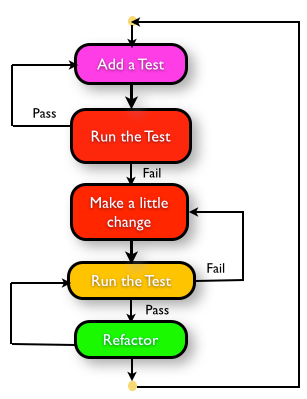

### tdd-workshop

The TDD and Refactoring Workshop offers a comprehensive, hands-on introduction to 

evolutionary design, clean code and automated testing.

Over the past decade, eXtreme Programming practices like User Stories, Test-Driven 

Development (TDD), Behavior Driven Developer (BDD), Refactoring, Continuous Integration 

and Automation have fundamentally changed software development processes and 

inherently how engineers work.

This workshop explores the foundations of TDD, unit testing, automated refactoring and 

improving the design of legacy code with the help of various patterns, strategies, tools and 

techniques. Students will learn essential test-first approaches via interactive discussions, 

multimedia content, hands-on exercises and quizzes.

#### Learning Outcomes

* Understand the thought process and steps involved during a typical test-driven session.
* Drive the development (design and implementation) of a User Story using automated tests.
* Discover improved confidence and increase in development speed by writing automated tests first!
* Identify poorly designed code by using our elaborate code smell vocabulary.
* Learn various automated refactoring techniques and strategies to carefully clean the identified code smells.
* Practice key techniques to break coupling between classes and micro-test each component independently.
* Incrementally transform complex and difficult classes into readable, well-structured, and well-designed code, while keeping them running at all times.

#### Course Outline

**Unit Testing**

* Philosophy of Developer Unit Testing
* Anatomy of Unit Testing Framework
* Automated Tests
* Overview of xUnit
* Levels of Testing

**Code Smells**

* Common Code Smells
* Dealing with Code Smells

**Refactoring**

* Purpose of Refactoring
* Refactoring Patterns
* Using Automated Refactoring

**Inside Out Test First - Test Driven Development** 

* Introduction to TDD
* Test First Vs Test Last
* TDD Rhythm: Red, Green, Refactor
* Crucial Design Principles
* Driving Design using TDD
* Different Styles of TDD

**Outside In Behaviour First - Behaviour Driven Development**

* Driving Implementation and Design from Scenarios
* Creating an Application from Scratch using Scenarios
* Crafting acceptance criteria for user stories
* Writing executable examples for each criteria
* Documenting Scenarios with Gherkin
* Demo of BDD frameworks (Cucumber, FitNesse, SpecFlow, Jasmine)
* Automation Hazards
* Safe Automation Practices

**Beyond Basics**

* Test Doubles/Fakes - Stubs, Mocks, Spy, Simulators...
* TDD in Legacy Code
* Breaking Dependencies in Legacy Code
* Patterns for writing effective tests

## Copyright and license

Copyright 2014 ~ 2019 Wen Hao

Licensed under [Apache License][1]

[1]: ./LICENSE